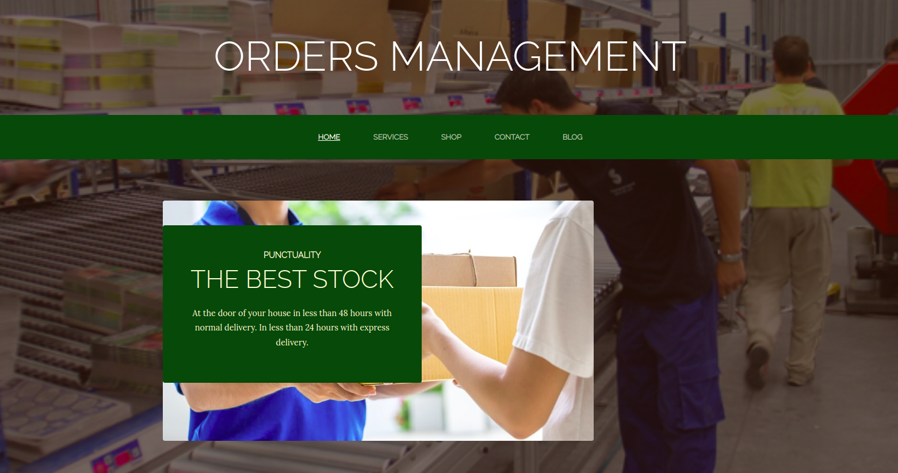

# Website With Django

## About this project

This is a simple web site with Django for the purpose of learning Django. The site is a simple order management system.

## Setup

Be sure to be running the latest version of Django and pip.

    $ pip install django
    $ cd website-with-django

## Development

To run the development server, run the following command:

    $ python manage.py runserver

To apply general migrations, run the following command:

    $ python manage.py migrations

To migrate the database, run the following command:

    $ python manage.py makemigrations

You can also run the development server in debug mode:

    $ python manage.py runserver --debug

### Django Admin

To access the Django admin, the username and password are:

    username: admin
    password: adminpwd
